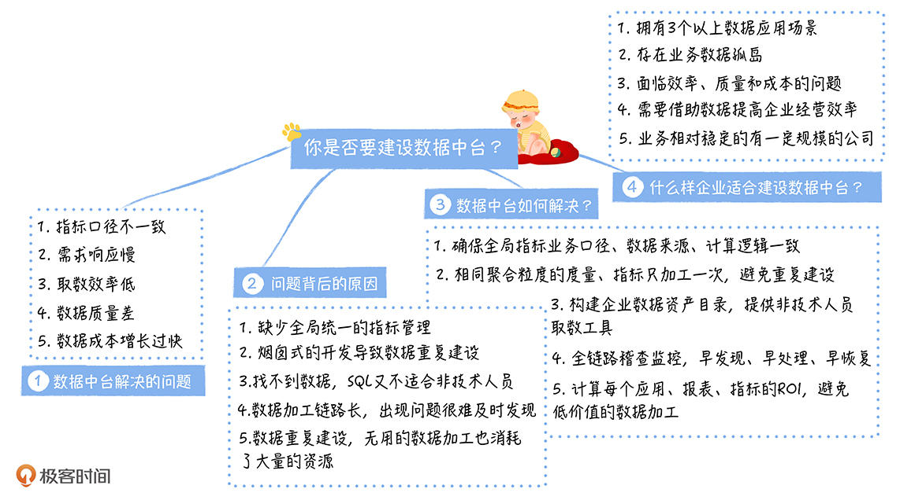

# 企业如何定位数据中台

## 以往企业管理模式面临的挑战
* 面临线上流量枯竭
* 业绩增长乏力
* 企业成本高筑
* 利润飞速下滑

## 如何解决企业管理模式面临挑战
    原先粗放的企业管理模式和经营模式已经无法继续支撑企业的高速增长，以往靠经验说话方式不可行了
    因此提出了数字化转型，强调数据是企业增长的行动力
    从   用户运营  商品运营   市场运营   来完成经营决策
---
## 目前企业暴露出的尖锐问题
  ```
    大量的数据出现，在不断提高企业运营效率的同时，传统的数据分析出现的一些弊端
  ```
* 指标口径不一致 （指标名称相同结果却不一样：含税不含税，没统一口径）
* 数据重复建设，响应时间长（交付时间，对业务数据的敏捷性）
* 取数效率低，大部分取数工作都依赖于开发（找数据，准确理解数据难）
* 数据质量差（计算逻辑错误等）
* 数据成本线性增长

## 出现以上问题，需要建立数据中台
* **指标口径不一致**
    ```
    1、业务口径不一致：明确区分两个指标之间不能有相同的标识
    2、计算逻辑不一致：相同指标有2个以上数据开发人员操作，之间的理解差异
    3、数据来源不一致：一个来自实时，一个来时离线
    ```
    综上所述：确保同一个指标只有一个业务口径，只加工一次，数据源必须相同 

* **数据重复建设，响应时间长**
    ```
    1、数据需求响应慢主要在于以往的烟囱式开发模式
    2、大量重复的逻辑代码
    ```
    综上所述：需要解决数据复用问题，确保相同的数据只加工一次，实现数据的共享

* **取数效率低**
    ```
    1、找不到数据：构建一个全局的企业数据资产目录，实现数据地图
    2、取不到数据：提供可视化可选择字段的查询平台
    ```
* **数据质量差**
    ```
    1、对庞大的数据很难发现数据的问题
    2、数据加工链路长，排查问题时间长
    ```
    综上所述：对数据问题需要及时发现，快速恢复数据问题

* **数据成本线性增长**
    ```
    成本问题主要是对数据利用不够，一些重复的数据计算逻辑等重复工作的存在
    ```
---
## 数据中台如何解决以上5大问题？
```
数据中台是企业构建的标准的，安全的，统一的，共享的数据组织，通过数据服务化的方式支撑前端数据应用
数据中台消除了冗余的数据，构建了企业级数据资产，提高数据共享能力
```
* 指标口径：
  * 原先指标管理非常分散，没有全局统一的管理，在数据中台中，必须要有一个团队统一负责指标口径的管理，实现指标体系化的管理，提高指标管理效率
  * 明确每个指标口径、数据来源、计算逻辑
  * 确保所有的数据产品、报表等都引用指标系统的口径定义


* 数据重复建设响应时间长
  * 实现数据只加工一次，要求相同粒度的度量或者指标只加工一次，构建全局一致的公共维度表
  * 数仓设计中心：强制相同聚合粒度，度量不能重复
  * 数据地图：快速理解数据表


* 取数效率
  * 数据中台通过服务化的方式，提高了数据应用接入和管理的效率。
  * 原先查询方式：“提供表->查询引擎->访问”   改为    “API接口直接访问”
  * 数据中台提供了可视化的取数平台，方便检索数据，取数方式从提交给技术到自助取数


* 数据质量
  * 数据中台对数据质量提出更高的要求
  * 实现数据的一致性、完整性、正确性、及时性的监督
  * 确保第一时间发现、恢复、和通知数据的问题


* 成本问题
  * 研发一个数据成本治理系统，从应用维度、表维度、任务维度、文件维度等进行全面治理
  * 及时发现和确定报表数据的价值以及上游表的产出价值

```
因此数据中台提高了数据研发效率和质量，降低了数据成本
```

---
## 企业建立数据中台前提
* 企业时候有大量的应用场景
* 企业存在较多的业务数据的孤岛，需要整合各个业务系统的数据，并进行关联的分析
* 企业数据团队正面临效率、质量和成本的苦恼，面向大量开发却不知如何提高效能
* 企业面临经营困难，需要通过数据实现精益运营，提高企业的运营效率
* 企业规模大，业务相对稳定的大公司

## 数据中台实现过程和问题解决
