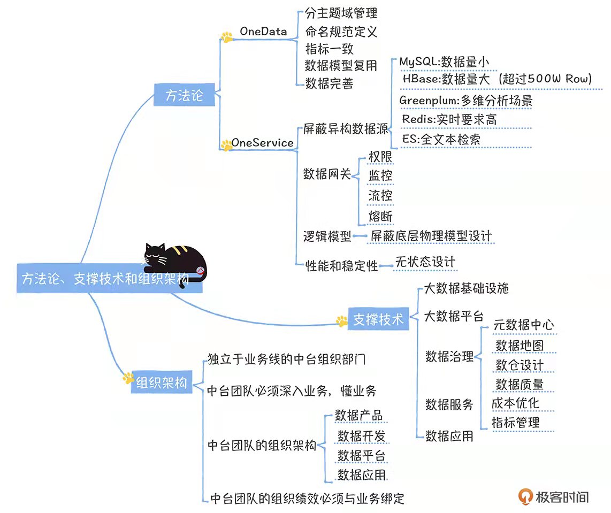
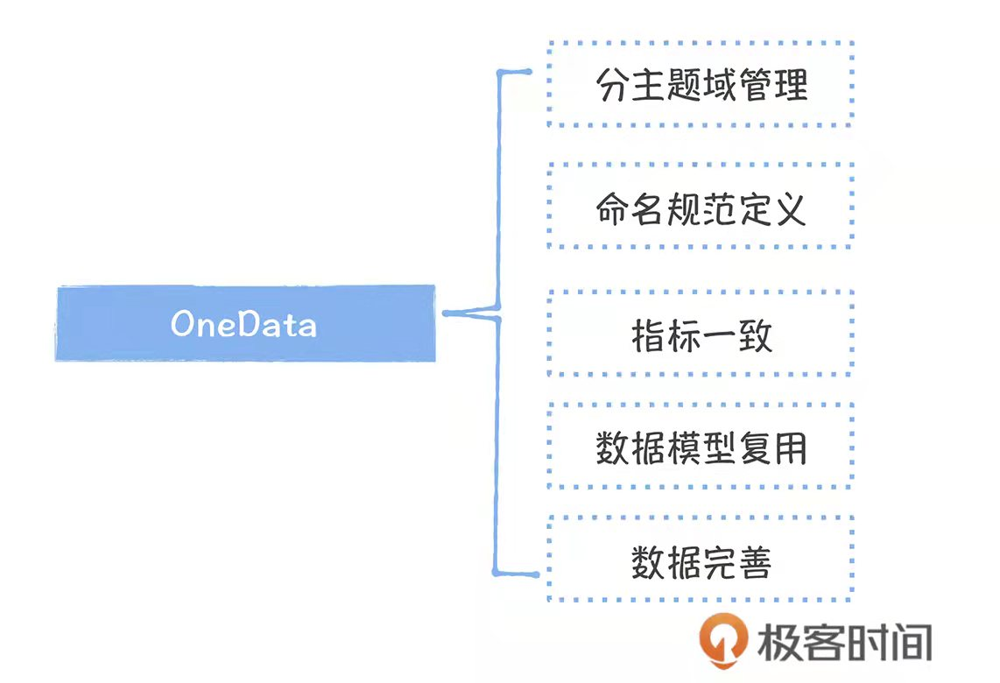
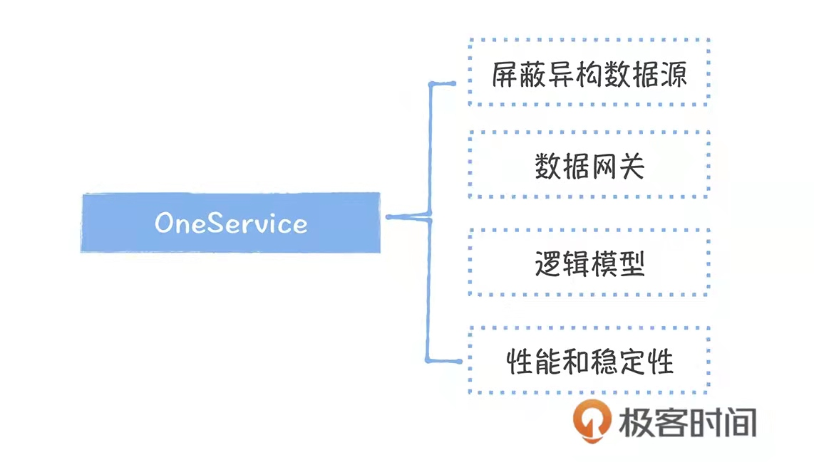
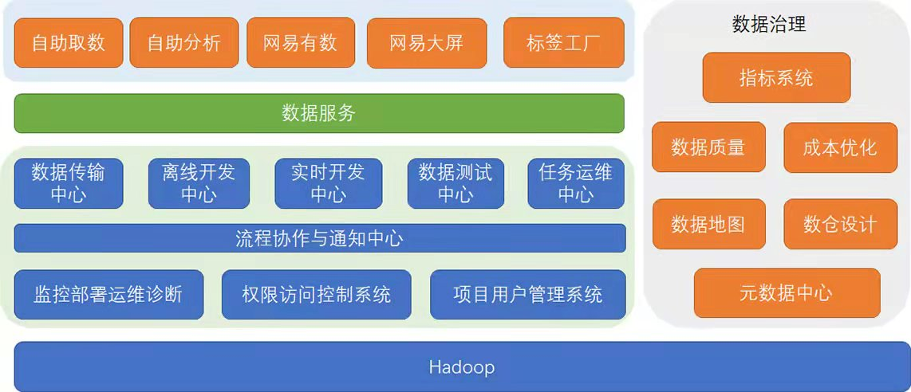

# 数据中台三要素：方法论、支撑技术、组织架构
观点：
* 数据中台是一种数据建设的方法论，按照数据中台设计方法和规范实施就可实现数据中台
* 数据中台的背后是数据部门组织架构的变更，把原先分散的组织架构形成一个统一的中台部门
* 基于一些现有的产品技术

```
 盖房子    VS    数据中台
设计图纸  <--->   方法论
 工具    <--->   支撑技术
施工队伍  <--->   组织架构
```


---
## 方法论：OneData、OneService
### OneData

```
    1、所有数据只加工一次，不会因为不同的应用场景，不同部门数据的重复加工
    2、数据中台是要在整个电商业务形成公共的数据层，消灭跨部门的小数仓，实现数据的复用
```
* 如何确保数据只加工一次
  * 分主题域管理
    * 把成千上万的数据表划分到不同的主题域中
    * 分域管理可提高管理效率
  * 命名规范定义
    * 表得名称最好能够携带表的主题域、业务过程、分层以及分区信息
  * 指标一致
    * 构建全局的指标字典
    * 所有表中的相同指标的口径必须一致
  * 数据模型复用
    * 采用分层设计方式
    * ODS原始数据层、DWD明细数据层、DWS轻度汇总数据层、ADS应用数据层、DM数据集市层
  * 数据完善
    * 尽可能覆盖所有的业务过程


* 体系目标
```
    1、构建统一的数据规范标准，让数据成为一种资产，而不是成本。
    2、资产和成本的差别在于资产是可以沉淀的，可以被复用的，而成本是消耗性质的，是临时的，无法被复用
```
### OneService

```
    1、数据即服务
    2、强调数据中台的数据是通过API接口服务的方式进行被访问
```
* API访问和直接访问数据库的区别
  * 当发生异常时，想要了解某张表可能要影响到下游的哪些应用或者哪些表时，会发现单纯依赖表关系与表的血缘无法触及应用，不能够知道这些表被哪些应用访问
  * 当想下线一张表，因不知道谁访问了这张表，无法实施，造成“上线容易，下线难”
  * 而API接口屏蔽了底层数据存储，使用统一的API接口查询数据，提高数据接入的速度
  * 对于数据开发，提高了数据应用的管理效率，建立了表到应用的链路关系


* 如何实现数据服务化
  * 屏蔽异构数据源
    * 数据服务必须要能够支撑类型丰富的查询引擎
  * 数据网关
    * 实现包括权限、监控、流控、日志在内的一系列管控能力
    * 模型能够实现实时跟踪
    * 使用数据的每个应用都应通过accesskey和secretkey实现身份认证和接口权限管理
    * 日志的快速排查
  * 逻辑模型
    * 从用户视角出发，面向用户提供逻辑模型
    * 屏蔽底层数据的物理实现
  * 性能和稳定性
    * 必须从无状态的、可以做到横向扩


* 体系目标
```
    1、提高数据的共享能力，让数据可以用的更好
```
---
## 支撑体系

* 底层以hadoop为代表的的大数据计算、存储基础设施、提供了大数据运行所需要的计算存储资源


* 浅绿色：缘由大数据平台范畴内的工具产品，覆盖了从数据集成、数据开发、数据测试、任务运维整套工具链路、以及包括监控运维系统、权限访问控制系统、项目用户管理系统


* 灰色（OneData）：数据中台的核心部分，也是数据治理模块，主要有5个产品
  * 指标系统 -> 指标
  * 数据质量 -> 质量
  * 成本优化 -> 成本
  * 数据地图 -> 数据发现
  * 数仓设计 -> 模型


* 深绿色（OneService）:数据服务，数据中台的门户，对外提供统一的数据服务
  * 面向非技术人员
  * 面向数据、开发分析师
  * 面向敏捷数据分析产品
  * 面向大数据大屏系统
  * 面向画像
---
  
## 组织架构
```
    必须要有一个独立于业务部门的中台团队，解决跨业务部门的数据共享能力
    懂业务、能够深入业务、扎根业务
    与业务落地价值绑定，衡量数据的应用价值
```
* **数据产品部门**
    
  负责数据中台、数据产品的体系规划、产品设计、规范制定、应用效果跟进、指标口径的定义和维护


* **数据平台部门**

  负责研发支撑数据中台建立的产品，如：指标系统、元数据中心、数据地图等


* **数据开发团队**

  负责维护数据中台的公共数据层，满足数据产品制定的数据需求


* **应用开发团队**

  负责开发数据应用产品，比如报表系统，电商种的供应链系统、高层看板、经营分析等
